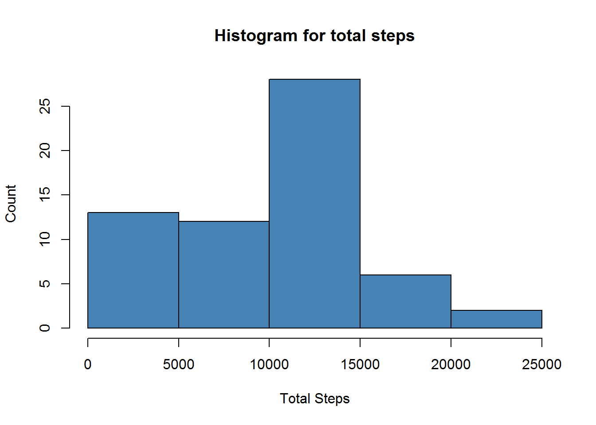
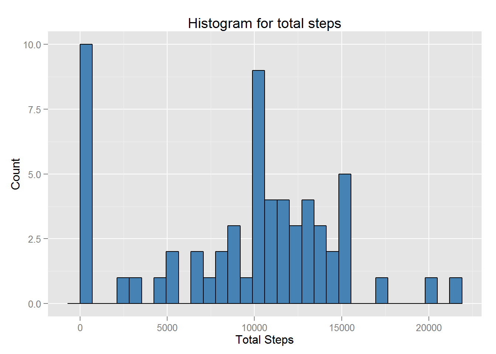
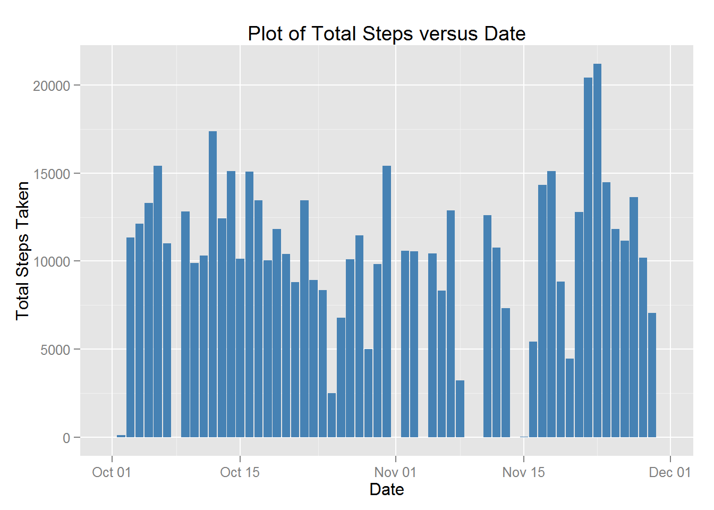
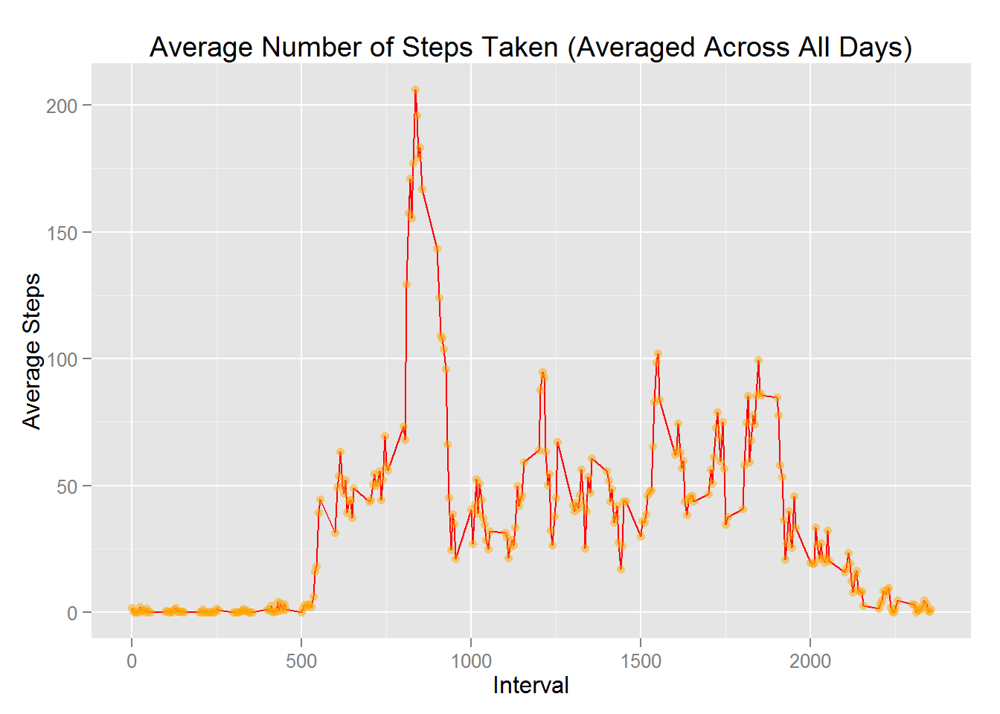
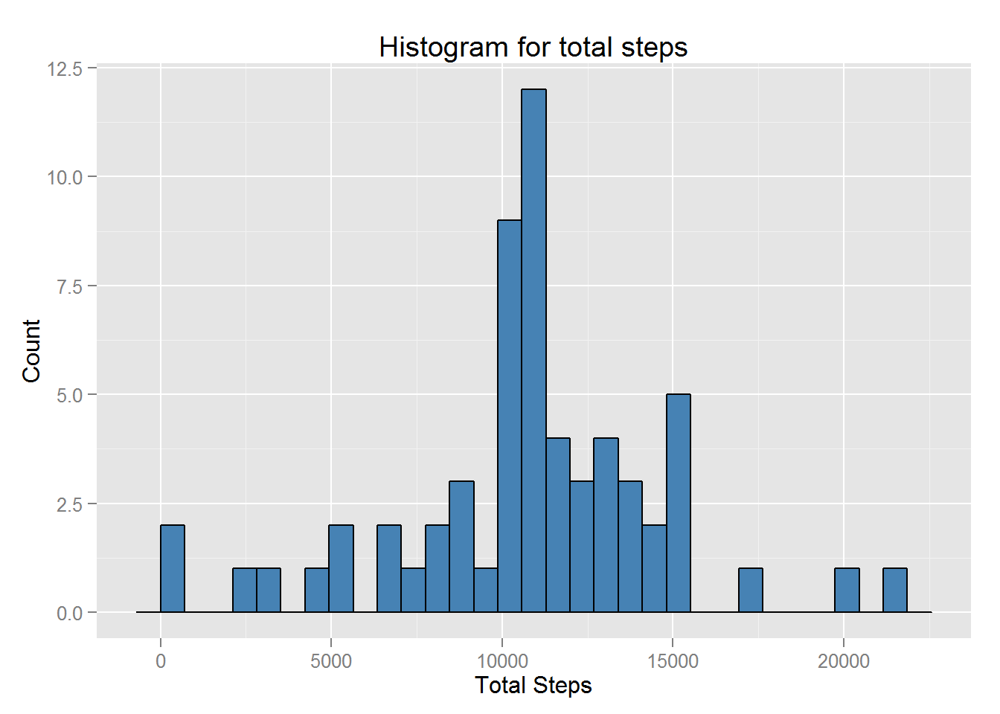
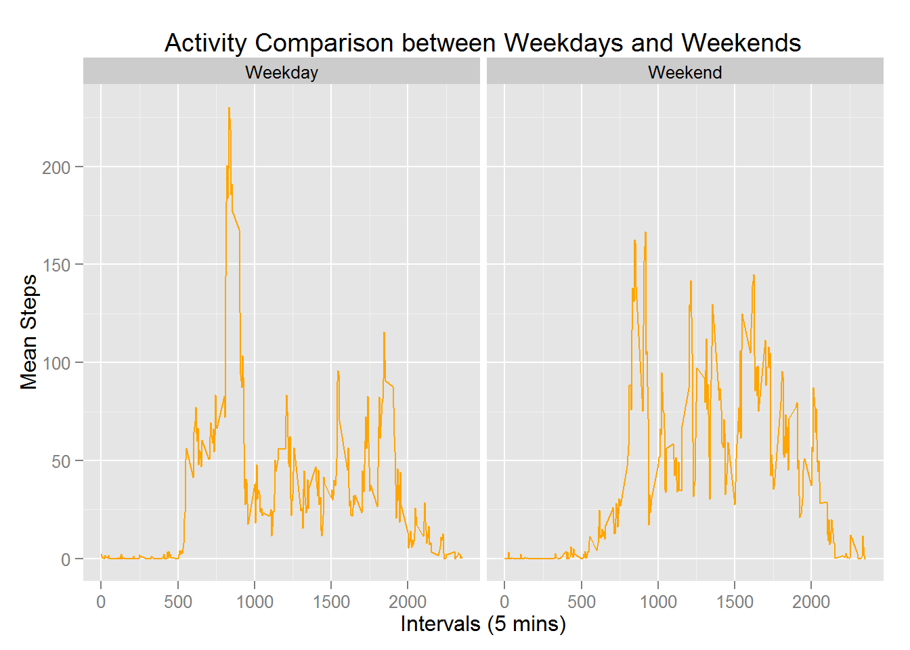

*PEER ASSESSMENT 1*
=================

#### This Assignment is a part of the course [Reproducible Research](https://www.coursera.org/course/repdata) provided by Johns Hopkins University on [Coursera](https://www.coursera.org/) ####

The dataset used in this assignment is: [Activity Monitoring Data](https://d396qusza40orc.cloudfront.net/repdata%2Fdata%2Factivity.zip)

This report analyzes the aforementioned dataset and answers the following questions:
<ul>
<li> `What is mean total number of steps taken per day?` </li>
<li> `What is the average daily activity pattern?` </li>
<li> `Input missing values.` </li>
<li> `Are there differences in activity patterns between weekdays and weekends?` </li>
</ul>
###The following describes the methodologies and procedures for answering the aforementioned questions:###

#### *STEP 1: Import Data* ####

1. The following R code snippet imports the data from the URL. Since the dataset is contained inside a zip archive, it needs to be extracted first.


```r
# Create a temporary directory
temp <- tempfile()
# Download file to the temp directory
download.file("http://d396qusza40orc.cloudfront.net/repdata%2Fdata%2Factivity.zip",temp)
# Unzip the file and read the CSV file
activity <- read.csv(unz(temp, "activity.csv"),stringsAsFactors=FALSE)
#unlink the temp directory
unlink(temp)
#View summary of the dataset
summary(activity)
```

```
##      steps            date              interval     
##  Min.   :  0.00   Length:17568       Min.   :   0.0  
##  1st Qu.:  0.00   Class :character   1st Qu.: 588.8  
##  Median :  0.00   Mode  :character   Median :1177.5  
##  Mean   : 37.38                      Mean   :1177.5  
##  3rd Qu.: 12.00                      3rd Qu.:1766.2  
##  Max.   :806.00                      Max.   :2355.0  
##  NA's   :2304
```

```r
#View the structure of the dataset
str(activity)
```

```
## 'data.frame':	17568 obs. of  3 variables:
##  $ steps   : int  NA NA NA NA NA NA NA NA NA NA ...
##  $ date    : chr  "2012-10-01" "2012-10-01" "2012-10-01" "2012-10-01" ...
##  $ interval: int  0 5 10 15 20 25 30 35 40 45 ...
```

#### *STEP 2: Transform data* ####

1. From the above step, the structure of the `activity` dataset shows that one of the columns has dates. Hence, it is prudent to convert the character class of `date` from char to the Date format.


```r
# Convert char to Date
activity$date <- as.Date(activity$date)
str(activity)
```

```
## 'data.frame':	17568 obs. of  3 variables:
##  $ steps   : int  NA NA NA NA NA NA NA NA NA NA ...
##  $ date    : Date, format: "2012-10-01" "2012-10-01" ...
##  $ interval: int  0 5 10 15 20 25 30 35 40 45 ...
```

2. Now, the dates are in the correct format and will enable easier manipulation.

#### *STEP 3: Analysis of activity per day (question 1)* ####

1. For calculating the parameters on a per day basis, we need to split the `activity` dataframe into sub data frames


```r
# Use the split function to split the data
by_date <- split(activity,activity$date)
# Calculate summed up value
summed <- data.frame(sapply(by_date,function(x){sum(x$steps,na.rm=TRUE)}))
print(summed)
```

```
##            sapply.by_date..function.x...
## 2012-10-01                             0
## 2012-10-02                           126
## 2012-10-03                         11352
## 2012-10-04                         12116
## 2012-10-05                         13294
## 2012-10-06                         15420
## 2012-10-07                         11015
## 2012-10-08                             0
## 2012-10-09                         12811
## 2012-10-10                          9900
## 2012-10-11                         10304
## 2012-10-12                         17382
## 2012-10-13                         12426
## 2012-10-14                         15098
## 2012-10-15                         10139
## 2012-10-16                         15084
## 2012-10-17                         13452
## 2012-10-18                         10056
## 2012-10-19                         11829
## 2012-10-20                         10395
## 2012-10-21                          8821
## 2012-10-22                         13460
## 2012-10-23                          8918
## 2012-10-24                          8355
## 2012-10-25                          2492
## 2012-10-26                          6778
## 2012-10-27                         10119
## 2012-10-28                         11458
## 2012-10-29                          5018
## 2012-10-30                          9819
## 2012-10-31                         15414
## 2012-11-01                             0
## 2012-11-02                         10600
## 2012-11-03                         10571
## 2012-11-04                             0
## 2012-11-05                         10439
## 2012-11-06                          8334
## 2012-11-07                         12883
## 2012-11-08                          3219
## 2012-11-09                             0
## 2012-11-10                             0
## 2012-11-11                         12608
## 2012-11-12                         10765
## 2012-11-13                          7336
## 2012-11-14                             0
## 2012-11-15                            41
## 2012-11-16                          5441
## 2012-11-17                         14339
## 2012-11-18                         15110
## 2012-11-19                          8841
## 2012-11-20                          4472
## 2012-11-21                         12787
## 2012-11-22                         20427
## 2012-11-23                         21194
## 2012-11-24                         14478
## 2012-11-25                         11834
## 2012-11-26                         11162
## 2012-11-27                         13646
## 2012-11-28                         10183
## 2012-11-29                          7047
## 2012-11-30                             0
```

2. The above method is a bit complicated and poses problems when plotting.

3. The second method is much easier and utilizes the `dplyr` library function `summarize`


```r
# Load the dplyr library
library(dplyr)
#Create a data frame of mean values per day using summarise
summed <- summarize(group_by(activity,date),total_steps=sum(steps,na.rm=TRUE))
print(summed)
```

```
## Source: local data frame [61 x 2]
## 
##          date total_steps
## 1  2012-10-01           0
## 2  2012-10-02         126
## 3  2012-10-03       11352
## 4  2012-10-04       12116
## 5  2012-10-05       13294
## 6  2012-10-06       15420
## 7  2012-10-07       11015
## 8  2012-10-08           0
## 9  2012-10-09       12811
## 10 2012-10-10        9900
## ..        ...         ...
```

Note: the `naN` indicates the presence of all `NA` values for the particular day.

4. To plot the histogram of `total steps` we use both the `base` and `ggplot2` plotting system


```r
#base system
hist(summed$total_steps,xlab="Total Steps",ylab="Count",col="steelblue",
     main="Histogram for total steps")
```

 

```r
# ggplot2 system
library(ggplot2)
g<-ggplot(summed,aes(total_steps))
g+geom_histogram(stat="bin",fill="steelblue",color="black")+labs(x="Total Steps",y="Count",title="Histogram for total steps")
```

 

5. Plot of the `total_steps` versus `date`


```r
#ggplot2 has already been loaded
# Define the base layer of the plot
sum <- ggplot(data=summed,aes(x=date,y=total_steps))
# Add the histogram layer
sum <- sum + geom_bar(stat="identity",fill="steelblue")
# Add labels
sum <- sum + labs(x="Date",y="Total Steps Taken",title="Plot of Total Steps versus Date")
# plot the graph
plot(sum)
```

 

6. Calculating the mean and median:


```r
paste("The mean is:",round(mean(summed$total_steps),2))
```

```
## [1] "The mean is: 9354.23"
```

```r
paste("The median is:",round(median(summed$total_steps),2))
```

```
## [1] "The median is: 10395"
```

#### *STEP 4: Average Daily Activity Pattern* ####

1. For this we need to calculate the average number of steps taken per interval averaged over all of the 61 days.


```r
mean_interval <- summarize(group_by(activity,interval),Mean=mean(steps,na.rm=TRUE))
print(mean_interval)
```

```
## Source: local data frame [288 x 2]
## 
##    interval      Mean
## 1         0 1.7169811
## 2         5 0.3396226
## 3        10 0.1320755
## 4        15 0.1509434
## 5        20 0.0754717
## 6        25 2.0943396
## 7        30 0.5283019
## 8        35 0.8679245
## 9        40 0.0000000
## 10       45 1.4716981
## ..      ...       ...
```

2. Potting the Average steps versus the interval using `ggplot2`


```r
# Make 1st ggplot layer
act<-ggplot(mean_interval,aes(interval,Mean))
# Add points, lines and labels
act+geom_line(lwd=.5,color="red")+geom_point(color="orange",alpha=0.5)+
    labs(x="Interval",y="Average Steps",title="Average Number of Steps Taken (Averaged Across All Days)")
```

 

3. Finding the interval with highest average steps


```r
mean_interval[which.max(mean_interval$steps),]
```

```
## Source: local data frame [0 x 2]
## 
## Variables not shown: interval (int), Mean (dbl)
```

#### *STEP 5: Input Missing Values* ####

1. The `activity` dataset contains a number of instances in the `steps` attribute which have missing values denoted by `NA`. The total number of missing values can be calculated as:


```r
sum(is.na(activity$steps))
```

```
## [1] 2304
```

2. To fill in the missing values we choose to assign them the mean value for that interval. The following code snippet inserts suitable values to the `NA` rows.


```r
# Define factor list to split the data on. Saved separately to ease unsplit
factor_interval <- factor(activity$interval)
# Split dataframe on factors based on the dates
splitted <- split(activity,factor_interval)
# Fill in NA values for each sub data frame using mean of the intervals
splitted <- lapply(splitted,function(x){
    indx <- which(is.na(x$steps))            # index number of rows with NA
    # mean_interval contains mean values of steps in each interval
    x[indx,1] <- mean_interval[x[indx,3]==mean_interval[,1],2]  # Replace "steps"       
    x
    }
    )
# Unsplit the data frame to a new dataframe as required
activity_no_NA <- unsplit(splitted,factor_interval)
print("The New Dataest with filled in NA values:")
```

```
## [1] "The New Dataest with filled in NA values:"
```

```r
head(activity_no_NA)
```

```
##       steps       date interval
## 1 1.7169811 2012-10-01        0
## 2 0.3396226 2012-10-01        5
## 3 0.1320755 2012-10-01       10
## 4 0.1509434 2012-10-01       15
## 5 0.0754717 2012-10-01       20
## 6 2.0943396 2012-10-01       25
```

```r
#check for missing values
sum(is.na(activity_no_NA))
```

```
## [1] 0
```

3. Difference between `activity` and `activity_no_NA`. We plot the histogram for total steps taken using the `ggplot2` plotting system. We also calculate the mean and median for the new dataset.


```r
# Sum up steps taken each day
summed_no_NA <- summarize(group_by(activity_no_NA,date),total_steps=sum(steps))
# Plot histogram
act2<-ggplot(summed_no_NA,aes(total_steps))
act2<-act2 + geom_histogram(stat="bin",color="black",fill="steelblue") + 
    labs(x="Total Steps",y="Count",title="Histogram for total steps")
plot(act2)
```

 

```r
# Calculate mean and median
paste("The mean is:",round(mean(summed_no_NA$total_steps),2))
```

```
## [1] "The mean is: 10766.19"
```

```r
paste("The median is:",round(median(summed_no_NA$total_steps),2))
```

```
## [1] "The median is: 10766.19"
```

4. It is obseverved that the `mean` value moves closer to the middle and the `median` is now closer to the mean than before.

#### *STEP 6: Activity patterns between Weekdays and Weekends* ####

1. First we need to classify the dates as Weekdays or Weekdends. For that purpose we utilize the `weekdays()` function which returns the day of the week based on date.


```r
factor_day<-weekdays(activity$date)     # Returns character vector with days
levels(factor(factor_day))
```

```
## [1] "Friday"    "Monday"    "Saturday"  "Sunday"    "Thursday"  "Tuesday"  
## [7] "Wednesday"
```

2. A list is created classifying the days into weekdays or weekends


```r
class_day<-sapply(factor_day,function(x){
    if(x=="Sunday" | x=="Saturday")
        y<-"Weekend"
    else
        y<-"Weekday"
    y
}
)
```

3. The list is added as a column to the `activity` dataset


```r
activity_no_NA$dayClass<-factor(class_day)
head(activity_no_NA)
```

```
##       steps       date interval dayClass
## 1 1.7169811 2012-10-01        0  Weekday
## 2 0.3396226 2012-10-01        5  Weekday
## 3 0.1320755 2012-10-01       10  Weekday
## 4 0.1509434 2012-10-01       15  Weekday
## 5 0.0754717 2012-10-01       20  Weekday
## 6 2.0943396 2012-10-01       25  Weekday
```

4. The mean of steps in each interval on weekdays and weekends is calculated


```r
day_sum<-summarize(group_by(activity_no_NA,dayClass,interval),
                   mean_steps=mean(steps,rm.na=T))
print(day_sum)
```

```
## Source: local data frame [576 x 3]
## Groups: dayClass
## 
##    dayClass interval mean_steps
## 1   Weekday        0 2.25115304
## 2   Weekday        5 0.44528302
## 3   Weekday       10 0.17316562
## 4   Weekday       15 0.19790356
## 5   Weekday       20 0.09895178
## 6   Weekday       25 1.59035639
## 7   Weekday       30 0.69266247
## 8   Weekday       35 1.13794549
## 9   Weekday       40 0.00000000
## 10  Weekday       45 1.79622642
## ..      ...      ...        ...
```

5. The mean number of steps is plotted for both weekdays and weekends


```r
wkd_wkend <- ggplot(data=day_sum,aes(interval,mean_steps))
wkd_wkend + facet_grid(.~dayClass)+geom_line(lwd=0.5,color="orange")+
    labs(x="Intervals (5 mins)",y="Mean Steps",title="Activity Comparison between Weekdays and Weekends")
```

 

__*Hence all the questions have been suitably answered with relevant codes and plots*__
